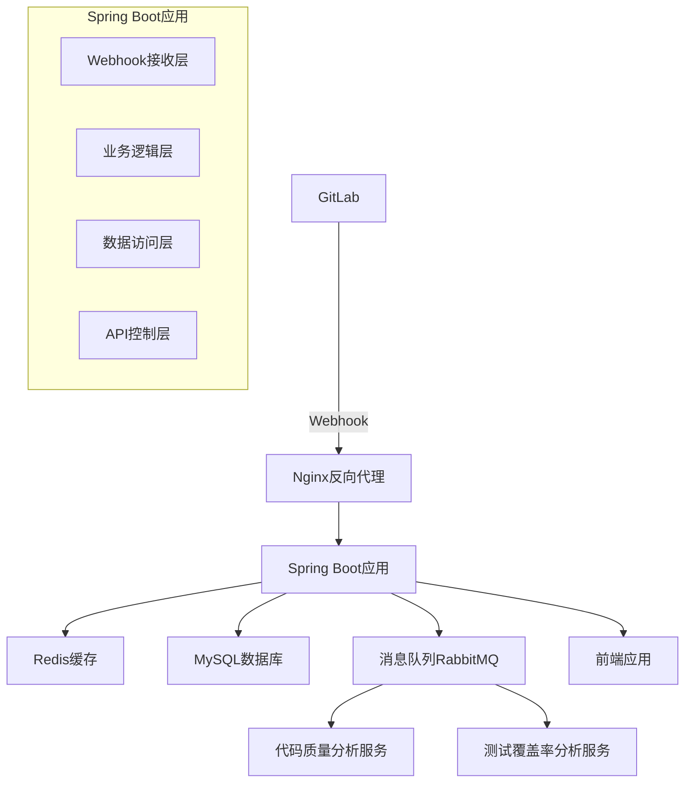

# 设计文档

## 概述

GitLab研发度量系统后端是一个基于Spring Boot 2.7.x（兼容JDK 1.8）的微服务应用，主要负责接收GitLab Webhook事件，分析研发数据，并为前端提供RESTful API接口。系统采用事件驱动架构，支持实时数据处理和批量数据分析。

## 架构

### 系统架构图



### 技术栈

- **框架**: Spring Boot 2.7.18 (最后支持JDK 1.8的版本)
- **数据库**: MySQL 8.0
- **缓存**: Redis 6.2
- **消息队列**: RabbitMQ 3.11
- **代码质量分析**: SonarQube Community Edition
- **构建工具**: Maven 3.6+
- **部署**: Docker + Docker Compose

## 组件和接口

### 1. Webhook接收组件 (WebhookController)

**职责**: 接收和验证GitLab Webhook事件

**接口设计**:
```java
@RestController
@RequestMapping("/api/webhook")
public class WebhookController {
    
    @PostMapping("/gitlab")
    public ResponseEntity<String> handleGitLabWebhook(
        @RequestHeader("X-Gitlab-Token") String token,
        @RequestHeader("X-Gitlab-Event") String eventType,
        @RequestBody String payload
    );
}
```

**事件类型处理**:
- Push Events: 代码提交事件
- Merge Request Events: 合并请求事件  
- Issue Events: 问题事件
- Pipeline Events: CI/CD流水线事件

### 2. 数据分析组件 (AnalysisService)

**职责**: 分析代码提交、质量、效率等指标

**核心服务**:
```java
@Service
public class CodeAnalysisService {
    public CommitMetrics analyzeCommit(CommitData commit);
    public QualityMetrics analyzeCodeQuality(String projectId, String commitSha);
    public TestCoverageMetrics analyzeTestCoverage(String projectId, String commitSha);
}

@Service  
public class EfficiencyAnalysisService {
    public DeveloperEfficiency calculateDeveloperMetrics(String developerId, DateRange range);
    public BugFixEfficiency analyzeBugFixTime(List<Issue> bugs);
    public ReviewEfficiency analyzeCodeReviewMetrics(List<MergeRequest> mrs);
}
```

### 3. 数据存储组件

**Repository层设计**:
```java
@Repository
public interface CommitRepository extends JpaRepository<Commit, Long> {
    List<Commit> findByDeveloperIdAndTimestampBetween(String developerId, LocalDateTime start, LocalDateTime end);
    
    @Query("SELECT c.developerId, COUNT(c), SUM(c.linesAdded), SUM(c.linesDeleted) " +
           "FROM Commit c WHERE c.timestamp BETWEEN :start AND :end GROUP BY c.developerId")
    List<Object[]> getDeveloperCommitStats(LocalDateTime start, LocalDateTime end);
}

@Repository
public interface QualityMetricsRepository extends JpaRepository<QualityMetrics, Long> {
    List<QualityMetrics> findByProjectIdOrderByTimestampDesc(String projectId);
    
    @Query("SELECT AVG(q.codeComplexity), AVG(q.duplicateRate), AVG(q.maintainabilityIndex) " +
           "FROM QualityMetrics q WHERE q.projectId = :projectId AND q.timestamp BETWEEN :start AND :end")
    QualityTrend getQualityTrend(String projectId, LocalDateTime start, LocalDateTime end);
}
```

### 4. API控制组件

**RESTful API设计**:
```java
@RestController
@RequestMapping("/api/metrics")
public class MetricsController {
    
    @GetMapping("/commits")
    public ResponseEntity<CommitStatsResponse> getCommitStats(
        @RequestParam(required = false) String developerId,
        @RequestParam(required = false) String projectId,
        @RequestParam String startDate,
        @RequestParam String endDate
    );
    
    @GetMapping("/quality")
    public ResponseEntity<QualityMetricsResponse> getQualityMetrics(
        @RequestParam String projectId,
        @RequestParam(required = false) String timeRange
    );
    
    @GetMapping("/efficiency")
    public ResponseEntity<EfficiencyDashboard> getEfficiencyDashboard(
        @RequestParam(required = false) String teamId,
        @RequestParam String period
    );
}
```

## 数据模型

### 核心实体设计

```java
@Entity
@Table(name = "commits")
public class Commit {
    @Id
    @GeneratedValue(strategy = GenerationType.IDENTITY)
    private Long id;
    
    @Column(nullable = false)
    private String commitSha;
    
    @Column(nullable = false)
    private String projectId;
    
    @Column(nullable = false)
    private String developerId;
    
    @Column(nullable = false)
    private String developerName;
    
    @Column(nullable = false)
    private LocalDateTime timestamp;
    
    private String message;
    private String branch;
    private Integer linesAdded;
    private Integer linesDeleted;
    private Integer filesChanged;
    
    @OneToMany(mappedBy = "commit", cascade = CascadeType.ALL)
    private List<FileChange> fileChanges;
}

@Entity
@Table(name = "quality_metrics")
public class QualityMetrics {
    @Id
    @GeneratedValue(strategy = GenerationType.IDENTITY)
    private Long id;
    
    @Column(nullable = false)
    private String projectId;
    
    @Column(nullable = false)
    private String commitSha;
    
    @Column(nullable = false)
    private LocalDateTime timestamp;
    
    private Double codeComplexity;
    private Double duplicateRate;
    private Double maintainabilityIndex;
    private Integer securityIssues;
    private Integer performanceIssues;
    private Integer codeSmells;
}

@Entity
@Table(name = "test_coverage")
public class TestCoverage {
    @Id
    @GeneratedValue(strategy = GenerationType.IDENTITY)
    private Long id;
    
    @Column(nullable = false)
    private String projectId;
    
    @Column(nullable = false)
    private String commitSha;
    
    @Column(nullable = false)
    private LocalDateTime timestamp;
    
    private Double lineCoverage;
    private Double branchCoverage;
    private Double functionCoverage;
    private Integer totalLines;
    private Integer coveredLines;
    private Integer totalBranches;
    private Integer coveredBranches;
}

@Entity
@Table(name = "merge_requests")
public class MergeRequest {
    @Id
    @GeneratedValue(strategy = GenerationType.IDENTITY)
    private Long id;
    
    @Column(nullable = false)
    private String mrId;
    
    @Column(nullable = false)
    private String projectId;
    
    @Column(nullable = false)
    private String authorId;
    
    @Column(nullable = false)
    private LocalDateTime createdAt;
    
    private LocalDateTime mergedAt;
    private LocalDateTime closedAt;
    private String status; // opened, merged, closed
    private String sourceBranch;
    private String targetBranch;
    private Integer changedFiles;
    private Integer additions;
    private Integer deletions;
    
    @OneToMany(mappedBy = "mergeRequest", cascade = CascadeType.ALL)
    private List<CodeReview> reviews;
}

@Entity
@Table(name = "code_reviews")
public class CodeReview {
    @Id
    @GeneratedValue(strategy = GenerationType.IDENTITY)
    private Long id;
    
    @ManyToOne
    @JoinColumn(name = "merge_request_id")
    private MergeRequest mergeRequest;
    
    @Column(nullable = false)
    private String reviewerId;
    
    @Column(nullable = false)
    private String reviewerName;
    
    @Column(nullable = false)
    private LocalDateTime reviewedAt;
    
    private String status; // approved, changes_requested, commented
    private String comment;
}
```

## 错误处理

### 异常处理策略

```java
@ControllerAdvice
public class GlobalExceptionHandler {
    
    @ExceptionHandler(WebhookValidationException.class)
    public ResponseEntity<ErrorResponse> handleWebhookValidation(WebhookValidationException e) {
        return ResponseEntity.status(HttpStatus.UNAUTHORIZED)
            .body(new ErrorResponse("WEBHOOK_VALIDATION_FAILED", e.getMessage()));
    }
    
    @ExceptionHandler(DataProcessingException.class)
    public ResponseEntity<ErrorResponse> handleDataProcessing(DataProcessingException e) {
        return ResponseEntity.status(HttpStatus.INTERNAL_SERVER_ERROR)
            .body(new ErrorResponse("DATA_PROCESSING_ERROR", e.getMessage()));
    }
    
    @ExceptionHandler(RateLimitExceededException.class)
    public ResponseEntity<ErrorResponse> handleRateLimit(RateLimitExceededException e) {
        return ResponseEntity.status(HttpStatus.TOO_MANY_REQUESTS)
            .body(new ErrorResponse("RATE_LIMIT_EXCEEDED", e.getMessage()));
    }
}
```

### 重试机制

```java
@Configuration
@EnableRetry
public class RetryConfig {
    
    @Bean
    public RetryTemplate retryTemplate() {
        RetryTemplate retryTemplate = new RetryTemplate();
        
        FixedBackOffPolicy backOffPolicy = new FixedBackOffPolicy();
        backOffPolicy.setBackOffPeriod(2000L);
        retryTemplate.setBackOffPolicy(backOffPolicy);
        
        SimpleRetryPolicy retryPolicy = new SimpleRetryPolicy();
        retryPolicy.setMaxAttempts(3);
        retryTemplate.setRetryPolicy(retryPolicy);
        
        return retryTemplate;
    }
}
```

## 测试策略

### 测试层次

1. **单元测试**: 使用JUnit 4 + Mockito
   - Service层业务逻辑测试
   - Repository层数据访问测试
   - Utility类功能测试

2. **集成测试**: 使用Spring Boot Test
   - Controller层API测试
   - 数据库集成测试
   - 消息队列集成测试

3. **端到端测试**: 使用TestContainers
   - Webhook接收流程测试
   - 完整数据处理流程测试

### 测试配置

```java
@SpringBootTest
@TestPropertySource(locations = "classpath:application-test.properties")
@Sql(scripts = "/test-data.sql", executionPhase = Sql.ExecutionPhase.BEFORE_TEST_METHOD)
@Sql(scripts = "/cleanup.sql", executionPhase = Sql.ExecutionPhase.AFTER_TEST_METHOD)
public class IntegrationTestBase {
    
    @Autowired
    protected TestRestTemplate restTemplate;
    
    @Autowired
    protected TestEntityManager entityManager;
}
```

### 性能测试

- 使用JMeter进行API性能测试
- 目标: Webhook接收响应时间 < 5秒
- 目标: API查询响应时间 < 2秒
- 目标: 支持并发1000个Webhook请求

## 安全设计

### Webhook安全验证

```java
@Component
public class WebhookSecurityValidator {
    
    @Value("${gitlab.webhook.secret}")
    private String webhookSecret;
    
    public boolean validateWebhook(String signature, String payload) {
        String expectedSignature = calculateHmacSha256(payload, webhookSecret);
        return MessageDigest.isEqual(
            signature.getBytes(StandardCharsets.UTF_8),
            expectedSignature.getBytes(StandardCharsets.UTF_8)
        );
    }
}
```

### API安全

```java
@Configuration
@EnableWebSecurity
public class SecurityConfig extends WebSecurityConfigurerAdapter {
    
    @Override
    protected void configure(HttpSecurity http) throws Exception {
        http
            .csrf().disable()
            .sessionManagement().sessionCreationPolicy(SessionCreationPolicy.STATELESS)
            .and()
            .authorizeRequests()
                .antMatchers("/api/webhook/**").permitAll()
                .antMatchers("/api/metrics/**").authenticated()
                .anyRequest().authenticated()
            .and()
            .oauth2ResourceServer().jwt();
    }
}
```

### 数据加密

- 敏感数据使用AES-256加密存储
- 传输层使用HTTPS/TLS 1.2+
- 数据库连接使用SSL

## 监控和日志

### 应用监控

```java
@Configuration
public class MonitoringConfig {
    
    @Bean
    public MeterRegistry meterRegistry() {
        return new PrometheusMeterRegistry(PrometheusConfig.DEFAULT);
    }
    
    @Bean
    public TimedAspect timedAspect(MeterRegistry registry) {
        return new TimedAspect(registry);
    }
}
```

### 日志配置

```xml
<!-- logback-spring.xml -->
<configuration>
    <springProfile name="!prod">
        <appender name="CONSOLE" class="ch.qos.logback.core.ConsoleAppender">
            <encoder>
                <pattern>%d{HH:mm:ss.SSS} [%thread] %-5level %logger{36} - %msg%n</pattern>
            </encoder>
        </appender>
        <root level="INFO">
            <appender-ref ref="CONSOLE"/>
        </root>
    </springProfile>
    
    <springProfile name="prod">
        <appender name="FILE" class="ch.qos.logback.core.rolling.RollingFileAppender">
            <file>logs/gitlab-metrics.log</file>
            <rollingPolicy class="ch.qos.logback.core.rolling.TimeBasedRollingPolicy">
                <fileNamePattern>logs/gitlab-metrics.%d{yyyy-MM-dd}.%i.gz</fileNamePattern>
                <maxFileSize>100MB</maxFileSize>
                <maxHistory>30</maxHistory>
            </rollingPolicy>
            <encoder class="net.logstash.logback.encoder.LoggingEventCompositeJsonEncoder">
                <providers>
                    <timestamp/>
                    <logLevel/>
                    <loggerName/>
                    <message/>
                    <mdc/>
                    <stackTrace/>
                </providers>
            </encoder>
        </appender>
        <root level="INFO">
            <appender-ref ref="FILE"/>
        </root>
    </springProfile>
</configuration>
```

## 部署架构

### Docker配置

```dockerfile
FROM openjdk:8-jre-alpine

VOLUME /tmp
COPY target/gitlab-metrics-backend-1.0.0.jar app.jar
ENTRYPOINT ["java","-Djava.security.egd=file:/dev/./urandom","-jar","/app.jar"]

EXPOSE 8080
HEALTHCHECK --interval=30s --timeout=3s --start-period=5s --retries=3 \
  CMD curl -f http://localhost:8080/actuator/health || exit 1
```

### Docker Compose配置

```yaml
version: '3.8'
services:
  app:
    build: .
    ports:
      - "8080:8080"
    environment:
      - SPRING_PROFILES_ACTIVE=prod
      - SPRING_DATASOURCE_URL=jdbc:mysql://mysql:3306/gitlab_metrics
    depends_on:
      - mysql
      - redis
      - rabbitmq
    
  mysql:
    image: mysql:8.0
    environment:
      MYSQL_ROOT_PASSWORD: root
      MYSQL_DATABASE: gitlab_metrics
    volumes:
      - mysql_data:/var/lib/mysql
    
  redis:
    image: redis:6.2-alpine
    volumes:
      - redis_data:/data
      
  rabbitmq:
    image: rabbitmq:3.11-management-alpine
    environment:
      RABBITMQ_DEFAULT_USER: admin
      RABBITMQ_DEFAULT_PASS: admin
    volumes:
      - rabbitmq_data:/var/lib/rabbitmq

volumes:
  mysql_data:
  redis_data:
  rabbitmq_data:
```