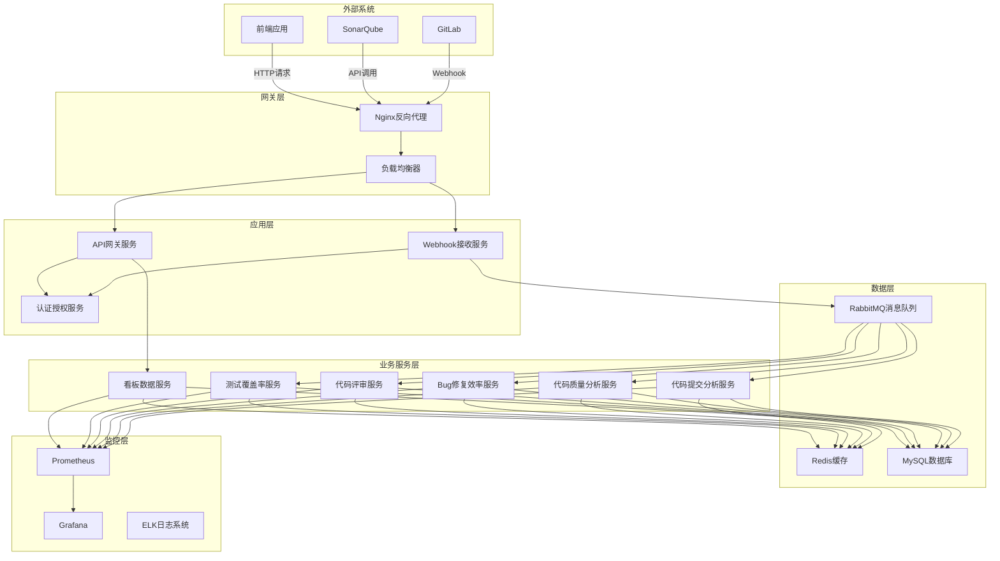
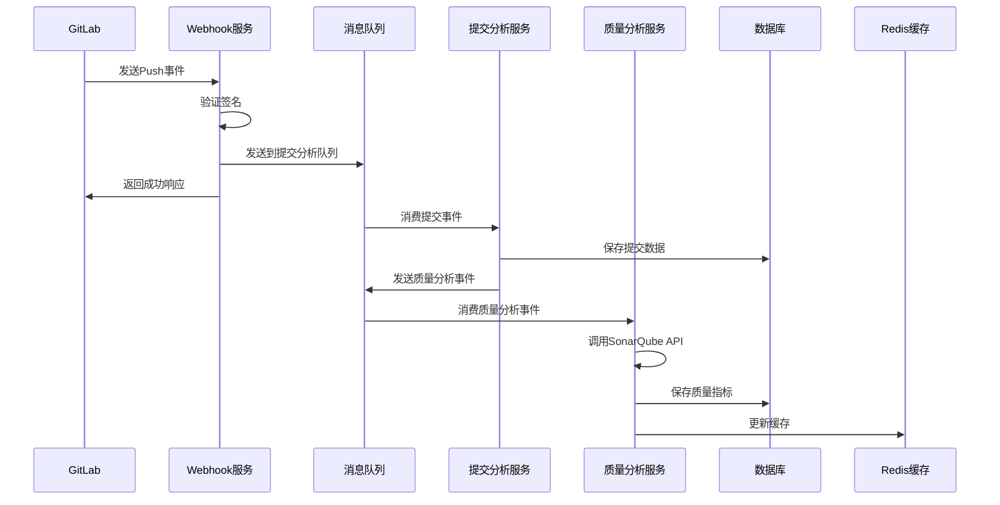
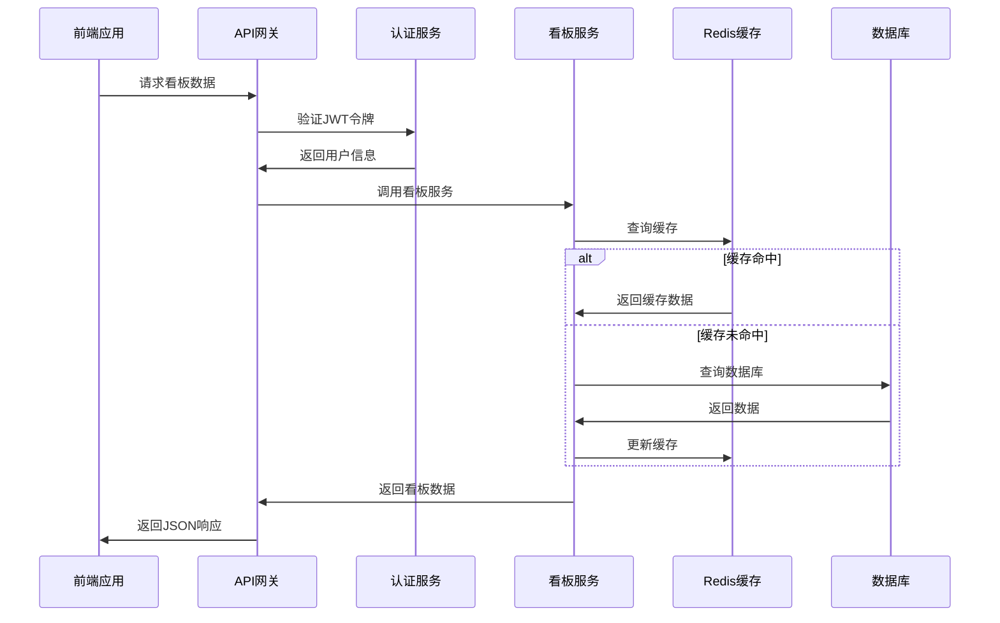

# GitLab研发度量系统架构文档

## 系统概述

GitLab研发度量系统是一个基于事件驱动架构的微服务应用，用于实时收集、分析和展示软件开发团队的研发效率指标。系统通过接收GitLab Webhook事件，自动分析代码提交、质量指标、Bug修复效率等关键数据，为团队提供全面的研发度量看板。

## 架构设计原则

### 1. 事件驱动架构
- 通过消息队列实现组件间的异步通信
- 提高系统的可扩展性和容错性
- 支持高并发的Webhook事件处理

### 2. 微服务设计
- 按业务功能划分服务边界
- 每个服务独立部署和扩展
- 通过API网关统一对外提供服务

### 3. 数据一致性
- 使用事务确保数据的一致性
- 通过消息队列实现最终一致性
- 支持数据回滚和补偿机制

### 4. 高可用性
- 无状态服务设计，支持水平扩展
- 数据库主从复制和读写分离
- 缓存层提升系统性能

## 系统架构图



## 核心组件详解

### 1. Webhook接收服务

**职责:**
- 接收GitLab发送的Webhook事件
- 验证Webhook签名和安全性
- 解析事件数据并分发到相应的处理队列

**技术实现:**
```java
@RestController
@RequestMapping("/api/webhook")
public class WebhookController {
    
    @Autowired
    private WebhookSecurityValidator securityValidator;
    
    @Autowired
    private WebhookEventDispatcher eventDispatcher;
    
    @PostMapping("/gitlab")
    public ResponseEntity<WebhookResponse> handleGitLabWebhook(
        @RequestHeader("X-Gitlab-Token") String token,
        @RequestHeader("X-Gitlab-Event") String eventType,
        @RequestBody String payload
    ) {
        // 验证签名
        if (!securityValidator.validateWebhook(token, payload)) {
            return ResponseEntity.status(HttpStatus.UNAUTHORIZED).build();
        }
        
        // 分发事件
        eventDispatcher.dispatch(eventType, payload);
        
        return ResponseEntity.ok(new WebhookResponse("success"));
    }
}
```

**关键特性:**
- 支持多种GitLab事件类型（Push、Merge Request、Issue等）
- 异步处理，快速响应GitLab请求
- 完整的错误处理和重试机制

### 2. 事件处理服务

**代码提交分析服务:**
```java
@Service
@RabbitListener(queues = "commit.analysis.queue")
public class CommitAnalysisService {
    
    public void analyzeCommit(PushEventRequest event) {
        // 解析提交数据
        List<Commit> commits = parseCommits(event);
        
        // 计算代码行数变更
        for (Commit commit : commits) {
            calculateCodeChanges(commit);
            commitRepository.save(commit);
        }
        
        // 发送质量分析事件
        rabbitTemplate.convertAndSend("quality.analysis.exchange", 
            "quality.analysis", event);
    }
}
```

**代码质量分析服务:**
```java
@Service
@RabbitListener(queues = "sonarqube.analysis.queue")
public class SonarQubeAnalysisService {
    
    @Autowired
    private SonarQubeClientService sonarQubeClient;
    
    public void analyzeQuality(QualityAnalysisRequest request) {
        // 调用SonarQube API获取质量指标
        QualityMetrics metrics = sonarQubeClient.getQualityMetrics(
            request.getProjectId(), request.getCommitSha());
        
        // 保存质量指标
        qualityMetricsRepository.save(metrics);
        
        // 检查质量门禁
        checkQualityGate(metrics);
    }
}
```

### 3. API网关服务

**职责:**
- 统一对外提供RESTful API接口
- 实现认证授权和权限控制
- API限流和缓存管理

**技术实现:**
```java
@RestController
@RequestMapping("/api/metrics")
@PreAuthorize("hasRole('USER')")
public class MetricsController {
    
    @Autowired
    private DashboardService dashboardService;
    
    @GetMapping("/dashboard")
    @Cacheable(value = "dashboard", key = "#teamId + '_' + #period")
    public ResponseEntity<DashboardResponse> getDashboard(
        @RequestParam(required = false) String teamId,
        @RequestParam(defaultValue = "month") String period
    ) {
        DashboardResponse response = dashboardService.getDashboardData(teamId, period);
        return ResponseEntity.ok(response);
    }
}
```

### 4. 数据存储层

**MySQL数据库设计:**

```sql
-- 核心表结构
CREATE TABLE commits (
    id BIGINT PRIMARY KEY AUTO_INCREMENT,
    commit_sha VARCHAR(40) NOT NULL UNIQUE,
    project_id VARCHAR(100) NOT NULL,
    developer_id VARCHAR(100) NOT NULL,
    developer_name VARCHAR(100) NOT NULL,
    timestamp DATETIME NOT NULL,
    message TEXT,
    branch VARCHAR(100),
    lines_added INT DEFAULT 0,
    lines_deleted INT DEFAULT 0,
    files_changed INT DEFAULT 0,
    INDEX idx_developer_timestamp (developer_id, timestamp),
    INDEX idx_project_timestamp (project_id, timestamp)
);

CREATE TABLE quality_metrics (
    id BIGINT PRIMARY KEY AUTO_INCREMENT,
    project_id VARCHAR(100) NOT NULL,
    commit_sha VARCHAR(40) NOT NULL,
    timestamp DATETIME NOT NULL,
    code_complexity DECIMAL(5,2),
    duplicate_rate DECIMAL(5,2),
    maintainability_index DECIMAL(5,2),
    security_issues INT DEFAULT 0,
    performance_issues INT DEFAULT 0,
    code_smells INT DEFAULT 0,
    INDEX idx_project_timestamp (project_id, timestamp)
);
```

**Redis缓存策略:**
```java
@Configuration
@EnableCaching
public class CacheConfig {
    
    @Bean
    public CacheManager cacheManager(RedisConnectionFactory connectionFactory) {
        RedisCacheConfiguration config = RedisCacheConfiguration.defaultCacheConfig()
            .entryTtl(Duration.ofHours(1))
            .serializeKeysWith(RedisSerializationContext.SerializationPair
                .fromSerializer(new StringRedisSerializer()))
            .serializeValuesWith(RedisSerializationContext.SerializationPair
                .fromSerializer(new GenericJackson2JsonRedisSerializer()));
        
        return RedisCacheManager.builder(connectionFactory)
            .cacheDefaults(config)
            .build();
    }
}
```

### 5. 消息队列架构

**RabbitMQ拓扑设计:**
```java
@Configuration
public class RabbitMQConfig {
    
    // 主交换机
    @Bean
    public TopicExchange gitlabEventsExchange() {
        return new TopicExchange("gitlab.events.exchange", true, false);
    }
    
    // 提交分析队列
    @Bean
    public Queue commitAnalysisQueue() {
        return QueueBuilder.durable("commit.analysis.queue")
            .withArgument("x-message-ttl", 3600000)
            .withArgument("x-max-length", 10000)
            .build();
    }
    
    // 绑定关系
    @Bean
    public Binding commitAnalysisBinding() {
        return BindingBuilder.bind(commitAnalysisQueue())
            .to(gitlabEventsExchange())
            .with("commit.push");
    }
}
```

## 数据流设计

### 1. Webhook事件处理流程



### 2. API查询处理流程



## 安全架构

### 1. 认证授权机制

```java
@Configuration
@EnableWebSecurity
@EnableGlobalMethodSecurity(prePostEnabled = true)
public class SecurityConfig extends WebSecurityConfigurerAdapter {
    
    @Override
    protected void configure(HttpSecurity http) throws Exception {
        http
            .csrf().disable()
            .sessionManagement().sessionCreationPolicy(SessionCreationPolicy.STATELESS)
            .and()
            .authorizeRequests()
                .antMatchers("/api/webhook/**").permitAll()
                .antMatchers("/api/auth/**").permitAll()
                .antMatchers("/actuator/health").permitAll()
                .anyRequest().authenticated()
            .and()
            .oauth2ResourceServer().jwt();
    }
}
```

### 2. 数据加密策略

```java
@Component
public class EncryptionUtil {
    
    @Value("${encryption.key}")
    private String encryptionKey;
    
    public String encrypt(String plainText) {
        try {
            Cipher cipher = Cipher.getInstance("AES/GCM/NoPadding");
            SecretKeySpec keySpec = new SecretKeySpec(
                encryptionKey.getBytes(), "AES");
            cipher.init(Cipher.ENCRYPT_MODE, keySpec);
            
            byte[] encrypted = cipher.doFinal(plainText.getBytes());
            return Base64.getEncoder().encodeToString(encrypted);
        } catch (Exception e) {
            throw new RuntimeException("Encryption failed", e);
        }
    }
}
```

## 监控和可观测性

### 1. 指标收集

```java
@Component
public class BusinessMetrics {
    
    private final Counter webhookCounter;
    private final Timer commitProcessingTimer;
    private final Gauge activeUsersGauge;
    
    public BusinessMetrics(MeterRegistry meterRegistry) {
        this.webhookCounter = Counter.builder("webhook.received.total")
            .description("Total number of webhooks received")
            .tag("type", "gitlab")
            .register(meterRegistry);
            
        this.commitProcessingTimer = Timer.builder("commit.processing.duration")
            .description("Time taken to process commits")
            .register(meterRegistry);
    }
    
    public void recordWebhookReceived(String eventType) {
        webhookCounter.increment(Tags.of("event_type", eventType));
    }
}
```

### 2. 健康检查

```java
@Component
public class DatabaseHealthIndicator implements HealthIndicator {
    
    @Autowired
    private DataSource dataSource;
    
    @Override
    public Health health() {
        try (Connection connection = dataSource.getConnection()) {
            if (connection.isValid(1)) {
                return Health.up()
                    .withDetail("database", "MySQL")
                    .withDetail("status", "Connected")
                    .build();
            }
        } catch (SQLException e) {
            return Health.down()
                .withDetail("database", "MySQL")
                .withDetail("error", e.getMessage())
                .build();
        }
        
        return Health.down()
            .withDetail("database", "MySQL")
            .withDetail("status", "Connection failed")
            .build();
    }
}
```

## 性能优化策略

### 1. 数据库优化

**索引策略:**
```sql
-- 复合索引优化查询
CREATE INDEX idx_commits_project_developer_timestamp 
ON commits(project_id, developer_id, timestamp);

-- 覆盖索引减少回表
CREATE INDEX idx_commits_stats 
ON commits(developer_id, timestamp, lines_added, lines_deleted);
```

**分区策略:**
```sql
-- 按月分区大表
ALTER TABLE commits PARTITION BY RANGE (TO_DAYS(timestamp)) (
    PARTITION p202401 VALUES LESS THAN (TO_DAYS('2024-02-01')),
    PARTITION p202402 VALUES LESS THAN (TO_DAYS('2024-03-01')),
    PARTITION p202403 VALUES LESS THAN (TO_DAYS('2024-04-01'))
);
```

### 2. 缓存优化

**多级缓存架构:**
```java
@Service
public class DashboardService {
    
    @Cacheable(value = "dashboard", key = "#teamId + '_' + #period")
    public DashboardResponse getDashboardData(String teamId, String period) {
        // L1缓存：本地缓存（Caffeine）
        // L2缓存：Redis分布式缓存
        // L3缓存：数据库查询结果
        
        return buildDashboardResponse(teamId, period);
    }
}
```

### 3. 异步处理优化

```java
@Configuration
@EnableAsync
public class AsyncConfig {
    
    @Bean("taskExecutor")
    public TaskExecutor taskExecutor() {
        ThreadPoolTaskExecutor executor = new ThreadPoolTaskExecutor();
        executor.setCorePoolSize(10);
        executor.setMaxPoolSize(50);
        executor.setQueueCapacity(200);
        executor.setThreadNamePrefix("async-task-");
        executor.setRejectedExecutionHandler(new ThreadPoolExecutor.CallerRunsPolicy());
        executor.initialize();
        return executor;
    }
}
```

## 扩展性设计

### 1. 水平扩展

- **无状态服务设计**: 所有业务服务都是无状态的，可以随意增减实例
- **负载均衡**: 通过Nginx或云负载均衡器分发请求
- **数据库读写分离**: 主库写入，从库读取，提升并发能力

### 2. 垂直扩展

- **服务拆分**: 按业务功能进一步拆分微服务
- **数据库分库分表**: 按项目或时间维度分片
- **消息队列集群**: RabbitMQ集群提升消息处理能力

### 3. 云原生支持

```yaml
# Kubernetes部署配置
apiVersion: apps/v1
kind: Deployment
metadata:
  name: gitlab-metrics-backend
spec:
  replicas: 3
  selector:
    matchLabels:
      app: gitlab-metrics-backend
  template:
    metadata:
      labels:
        app: gitlab-metrics-backend
    spec:
      containers:
      - name: app
        image: gitlab-metrics-backend:1.0.0
        ports:
        - containerPort: 8080
        env:
        - name: SPRING_PROFILES_ACTIVE
          value: "prod"
        resources:
          requests:
            memory: "512Mi"
            cpu: "500m"
          limits:
            memory: "1Gi"
            cpu: "1000m"
```

## 总结

GitLab研发度量系统采用现代化的微服务架构，具备以下特点：

1. **高可用性**: 通过负载均衡、数据库主从复制、缓存集群等技术保证系统的高可用性
2. **高性能**: 通过异步处理、多级缓存、数据库优化等手段提升系统性能
3. **可扩展性**: 无状态服务设计，支持水平和垂直扩展
4. **安全性**: 多层安全防护，包括认证授权、数据加密、网络安全等
5. **可观测性**: 完善的监控、日志、链路追踪体系
6. **云原生**: 支持容器化部署和Kubernetes编排

该架构能够满足企业级应用的需求，支持大规模团队的研发度量需求，并具备良好的可维护性和可扩展性。